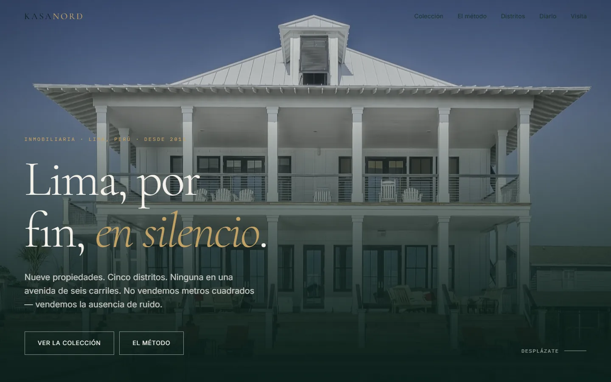

<p align="center">
  <a href="https://frankusqabant.github.io/kasa-nord/">
    
  </a>
</p>

# KASA NORD

**Inmobiliaria de lujo · Lima, Perú**

> No vendemos metros cuadrados — vendemos la ausencia de ruido.

Landing page para una inmobiliaria limeña de propiedades de $500K+. El
posicionamiento se niega a fingir que Lima es fácil: el sitio publica la
medición real de cada casa — decibeles, distancia al centro, horario de visita
— y admite explícitamente que el silencio absoluto no existe en esta ciudad.

## Ver en vivo

🌐 **[frankusqabant.github.io/kasa-nord](https://frankusqabant.github.io/kasa-nord/)**

## Qué hay aquí

```
index.html            home completo (7 secciones)
assets/css/tokens.css sistema de diseño: color, tipografía, espacio, motion
assets/css/main.css   12 componentes
assets/js/main.js     reveal on scroll, stagger de palabras, contadores
assets/webp/          44 fotos en WebP, 2 anchos cada una (srcset)
scripts/fetch.js      descargador de fotos por categoría
scripts/convert-all.js  JPEG → WebP (2 anchos por foto)
docs/hero.webp        captura del proyecto
01-estrategia.md      documento de marca y arquitectura
```

## Stack

HTML, CSS y JavaScript planos. Sin build, sin framework, sin dependencias.
Un `.html` abierto en el navegador ya funciona.

## Local

```bash
python -m http.server 5173
# → http://localhost:5173
```

## Detalles

- **Peso de primera carga** ~300 KB en 8 peticiones (medido: 970 KB → 299 KB)
- **Imágenes** 100% WebP, dos anchos por foto; `srcset` + `sizes` para que
  el navegador descargue solo lo que necesita
- **Fuentes** Cormorant Garamond + Inter + IBM Plex Mono, vía Google Fonts
- **Fotografías** [Pixabay](https://pixabay.com) — licencia libre, sin atribución
- **Tipografía de contenido** Inter; la serif es exclusivamente para display
- **Animaciones** respetan `prefers-reduced-motion`

---

Contenido y datos de propiedades **ficticios**, para demostración.
